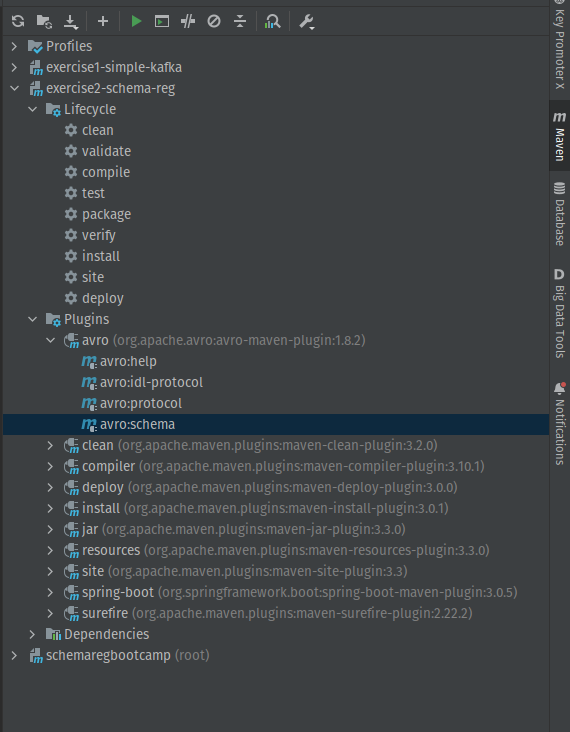

## Exercise 2

So for this one we're going to be working with AVRO. Check the resource folder of this module and you'll find "Person.avsc"  
This looks an awful like a json schema but with some added info. Don't worry too much about the differences. For this exercise its important to not restart the Docker containers or you'll have to repeat the steps.

1.  In the pom of this module I've included a maven plugin that will generate the class from the schema for you.  
    The class is already built but, you'll be modifying it soon enough.  
    Click this and it will re-build the class for you  
      
2.  Inspect CoreApplication and KafkaConfig again. There's a few differences about. I've commented most of it. But notice we're using KafkaAvro(De)Serializers and sending a specific type.  Our Producer and Consumer also have a reference to the schema registry URL also.
3.  Run the main class, and you'll see it sends Person to a separate Kafka topic This class is Java Generated code from the AVRO schema. Have a look on Kafka ui to see the message. Check out the Schema Registry as well while your at it. We should have one new schema.
4.  Check back in the spring logs and you'll see we received a generic record yet can still decode it. It just acts as hashmap.
5.  Now to get your hands dirty, again without restarting the docker containers, go edit the schema by removing bloodtype from it.  
    Rebuild the class by using the plugin once again, and update the pojo in send message to not reference the deleted field.
6.  Rerun the app, notice it still sent and the listener managed to decode it? Check schema registry in the Kafka ui again.  
    We now have two versions of the schema, still under one subject. So, we have backwards compatible change to our schema that the registry generously allowed us to register.  
    Consumers can continue to deserialize the message using the older schema. (Note that anyone actually using the field would still have to guard against trying to query a non-existing field)
    The level of compatibility can be set when registering schemas to a subject, BACKWARD is the default.
7.  Add a new field to the schema, don't reuse the bloodtype. Add a lastname field of type string, now rebuild and start the app. What happens? Why?

## Bonus if you have time
Inspect the kafka message on Kafka UI, look at the headers and value, pretty bare right?  
Now in your listen method set a breakpoint on the ConsumerRecord and inspect the headers and value. What's there? Why?